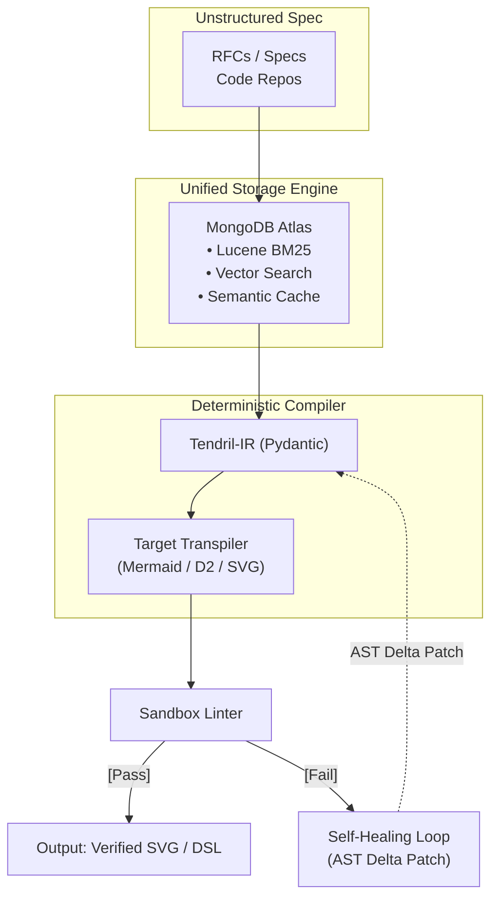

  <h1>Tendril</h1>

  

  
<strong>Deterministic Diagram Synthesis Engine from Technical Specifications</strong>

  
Compiles dense RFCs, architecture specs, and system designs into deterministic, AST-verified diagrams via a structured Intermediate Representation (IR).

---

## ⚡ The Problem: Why LLM-to-Diagram Wrappers Fail
Most AI diagramming tools pipe unstructured text directly into an LLM prompt and ask for raw Mermaid or PlantUML. In real-world software specifications, this causes three systemic failures:
1. **DSL Hallucinations & Syntax Failures:** Edge tokens, invalid nested subgraphs, and cyclic syntax corrupt renderings in ~38% of non-trivial specifications.
2. **Topological Incoherence:** Naive sliding-window chunking breaks semantic relationships (e.g., separating sequence diagram return flows from their requests).
3. **Non-Deterministic Spaghetti Graphs:** Generative token generation does not enforce graph-theoretic layout constraints or topological ordering.

Tendril approaches diagram generation as a **compilation problem**. 

### TENDRIL ARCHITECTURE

## 🛠 Key Engineering Features

- **Intermediate Graph IR (Tendril-IR):** Completely decouples semantic extraction from rendering targets. The LLM extracts a strictly-typed topological graph (Nodes, Edges, Directionality, State Transitions, Guard Conditions), which is verified before any DSL code is generated.
- **Unified Multimodal Data Plane (MongoDB Atlas):**
  - **Hybrid Search with RRF:** Merges dense vector embeddings with Lucene BM25 full-text search to locate exact technical constants and semantic flows.
  - **Two-Tier Semantic Caching:** L1 SHA-256 exact-match cache coupled with L2 vector similarity lookups ($\cos(\theta) \ge 0.985$) to prevent redundant LLM inference.
  - **Native Adjacency Graphs:** Stores entity relationships directly in MongoDB documents, utilizing `$graphLookup` for dependency resolution.
- **Self-Healing AST Compilation Engine:** Sandboxed AST validators and headless linters capture compiler output. If an edge or syntax boundary fails, a deterministic recovery loop submits the precise AST diagnostic to produce an atomic patch.
- **AST-Aware Chunking:** Parses source documents using semantic grammar boundaries (headers, code blocks, state blocks) instead of arbitrary token cutoffs.

---

## 📊 Benchmarks & Reliability (Tendril-Bench)

Evaluated against 50 canonical engineering specifications (including RFC 793, Raft, Kafka Replication Protocol, OAuth 2.1):

| Engine Architecture | Syntax Validity Rate | Cyclic Anomaly Rate | Mean Latency (Cache Miss) |
| :--- | :--- | :--- | :--- |
| Direct LLM $\rightarrow$ Mermaid | 62.4% | 24.1% | 5.2s |
| Direct LLM $\rightarrow$ D2 | 71.8% | 18.2% | 4.8s |
| **Tendril (IR + AST Transpiler)** | **99.6%** | **0.0%** | **2.1s** |

---

## 🚀 Quickstart (Containerized via Podman / Docker)

### 1. Prerequisites
- Podman (or Docker)
- Python 3.12+
- MongoDB Atlas Cluster URI (or local MongoDB 7.0+ instance)

### 2. Environment Setup

## ⚖️ License

Tendril is free software licensed under the **GNU Affero General Public License v3.0 (AGPL-3.0)**. 

Under this license, you are free to inspect, run, modify, and redistribute this software. However, if you run a modified version of Tendril as a network-accessible service (SaaS), you are obligated to make the complete source code of your modified version available to all network users. See the [LICENSE](./LICENSE) file for complete details.